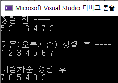
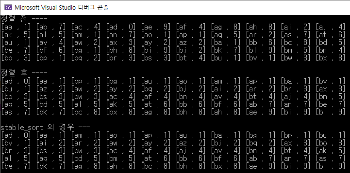

# STL Library - Algorithm (sort)

알고리즘 헤더중 정렬함수에 대해 알아보도록 하겠다

sorting은 자주쓰이는 것은 sort, stable_sort, partial_sort, is_sorted로 쓸 수 있다.


## 1. sort함수

sort함수는 정렬할 원소의 시작 위치와, 마지막 위치바로 뒤를 이터레이터로 받아서 정렬한다.

sort함수는 기본적으로 오름차순 정렬이다.

내림차순 정렬등의 다른 정렬방법을 사용하고 싶다면 compare함수를 사용해서 정렬하도록 한다.

```
ex) sort(v.begin(),v.end());
```


### sort 함수 사용 예시

```c++
#include <algorithm>
#include <iostream>
#include <vector>
using namespace std;

template <typename Iter>
void print(Iter begin, Iter end) {
	while (begin != end) {
		cout << *begin << " ";
		begin++;
	}
	cout << endl;
}
struct int_compare 
{
	bool operator()(const int& a, const int& b) 
		const { return a > b; }
};

int main() {
	vector<int> vec;
	vec.push_back(5);
	vec.push_back(3);
	vec.push_back(1);
	vec.push_back(6);
	vec.push_back(4);
	vec.push_back(7);
	vec.push_back(2);

	cout << "정렬 전 ----" << endl;
	print(vec.begin(), vec.end());
	cout<<endl;

	cout << "기본(오름차순) 정렬 후 ----" << endl;
    sort(vec.begin(), vec.end());
	print(vec.begin(), vec.end());
    cout<<endl;
    
    cout << "내림차순 정렬 후 --------" <endl;
    sort(vec.begin(), vec.end(), int_compare()); //int_compare대신에 greater<int>()를 쓸수도 있다.
	print(vec.begin(), vec.end());
        
}
```


### sort함수 사용 예시 실행결과

  


## 2. partial_sort 함수

partial_sort 함수는 일부만 정렬하는 함수로 인자를 기본으로 3개를 가진다.

```c++
partial_sort(v.begin(),v.begin()+3,v.end())
// v.begin() 부터 v.end() 까지 (즉 벡터 전체에서) 원소들 중에서, v.begin() 부터 v.begin() + 3 까지에 전체에서 가장 작은 애들만 순서대로 저장하고 나머지 원소들은 그대로 놔두는 것
```


### partial_sort 함수 사용 예시

```c++
#include <algorithm>
#include <iostream>
#include <vector>
using namespace std;

template <typename Iter>

void print(Iter begin, Iter end) 
{
	while (begin != end) 
	{
		cout << *begin << " ";
		begin++;
	}
	cout << endl;
}

int main() {
	vector<int> vec;
	vec.push_back(5);
	vec.push_back(3);
	vec.push_back(1);
	vec.push_back(6);
	vec.push_back(4);
	vec.push_back(7);
	vec.push_back(2);

	cout << "정렬 전 ----" << endl;
	print(vec.begin(), vec.end());
	partial_sort(vec.begin(), vec.begin() + 3, vec.end());

	cout << "정렬 후 ----" << endl;
	print(vec.begin(), vec.end());
}
```


### partial_sort 함수 사용 예시 실행 결과


## 3. stable_sort 함수

stable_sort는 원소가 삽입되어 있는 순서를 보존하는 정렬방식이다.

즉 같은 원소가 있다면 삽입한 순서대로의 순서를 보존해주는 방식이다. 


### stable_sort 함수 사용 예시

```c++
#include <algorithm>
#include <functional>
#include <iostream>
#include <string>
#include <vector>

using namespace std;
template <typename Iter>
void print(Iter begin, Iter end) {
	int i = 0;
	while (begin != end) {
		cout << "[" << *begin << "] ";
		begin++;
		i++;
		if (i % 10==0)
			cout << endl;
	}
	cout << endl;
}
struct User {
	string name;
	int age;

	User(string name, int age) : name(name), age(age) {}

	bool operator<(const User& u) const { return age < u.age; }
};

ostream& operator<<(ostream& o, const User& u) {
	o << u.name << " , " << u.age;
	return o;
}

int main() {
	vector<User> vec;
	for (int i = 0; i < 50; i++) {
		string name = "";
		name.push_back('a' + i / 26);
		name.push_back('a' + i % 26);
		vec.push_back(User(name, static_cast<int>(rand() % 10)));
	}

	vector<User> vec2 = vec;

	cout << "정렬 전 ----" << endl;
	print(vec.begin(), vec.end());

	sort(vec.begin(), vec.end());

	cout << "정렬 후 ----" << endl;
	print(vec.begin(), vec.end());

	cout << "stable_sort 의 경우 ---" << endl;
	stable_sort(vec2.begin(), vec2.end());
	print(vec2.begin(), vec2.end());
}
```


### stable_sort 함수 실행 결과




## 4. is_sorted 함수

is_sorted 함수는 주어진 함수의 범위가 정렬되어있는지 안되어있는지를 반환하는 함수이다 

정렬이 되있다면 True, 정렬이 안되있다면 False를 리턴한다.


### is_sorted 함수 사용 예시

```c++
#include <algorithm>
#include <iostream>
#include <vector>
using namespace std;

template <typename Iter>
void print(Iter begin, Iter end) {
	while (begin != end) {
		cout << *begin << " ";
		begin++;
	}
	cout << endl;
}

struct int_compare {
	bool operator()(const int& a, const int& b) const { return a < b; }
};

int main() {
	vector<int> vec;
	vec.push_back(5);
	vec.push_back(3);
	vec.push_back(1);
	vec.push_back(6);
	vec.push_back(4);
	vec.push_back(7);
	vec.push_back(2);

	cout << "정렬 전 ----" << endl;
	print(vec.begin(), vec.end());
	cout << "is_sorted() : " << is_sorted(vec.begin(), vec.end()) << endl;

	cout << "정렬 후 ----" << endl;
	sort(vec.begin(), vec.end(), int_compare());
	cout << "is_sorted() : " << is_sorted(vec.begin(), vec.end()) << endl;
	print(vec.begin(), vec.end());
}
```


### is_sorted 함수 사용 예시 실행 결과


