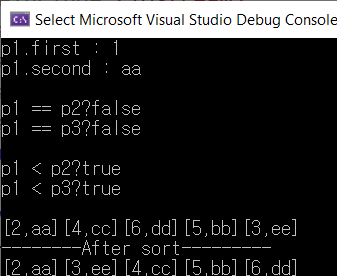

# STL Library - pair

pair는 두 객체를 하나의 객체로 취급할 수 있게 묶어 주는 클래스이다.

STL에서 데이터 쌍을 표현할때 사용한다.

<utility> 헤더에 존재한다

sort알고리즘으로 정렬이 가능하며 첫번째인자기준-> 두번째인자기준 ->.... 순서로 진행된다.

### pair 선언 방법

```c++
#include <iostream>
#include <utility> //pair 라이브러리

int main()
{
	pair <int, string> p1; //pair 선언
    pair <int, string>::iterator iter; //이터레이터 선언
    


	return 0;
}
```

### pair 내장 함수

* `p1.first` : p의 첫번째 인자를 반환해준다.


* `p1.second` : p의 두번째 인자를 반환해준다.


* `make_pair(변수1, 변수2)` : 변수1과 변수2가 들어간 pair를 만들어준다.


### 소스코드 사용 예시

```c++
#include <iostream>
#include <utility>
#include <string>
#include <vector>
#include <algorithm>
using namespace std;

void same(pair<int, string> a, pair<int, string> b)
{
	if (a == b)
		cout << "true" << endl;
	else
		cout << "false" << endl;
}

void comp(pair<int, string> a, pair<int, string> b)
{
	if (a < b)
		cout << "true" << endl;
	else
		cout << "false" << endl;
}
int main()
{
	pair <int, string> p1 = make_pair(1, "aa");
	pair <int, string> p2 = make_pair(3, "cc");
	pair <int, string> p3 = make_pair(1, "bb");

	cout << "p1.first : " << p1.first << endl;
	cout << "p1.second : " << p1.second << endl;
	cout << endl;

	cout << "p1 == p2?";
	same(p1, p2);
	cout << "p1 == p3?";
	same(p1, p3);
	cout << endl;

	cout << "p1 < p2?";
	comp(p1, p2);
	cout << "p1 < p3?";
	comp(p1, p3);
	cout << endl;

	vector <pair<int, string>> v;
	vector <pair<int, string>>::iterator iter;

	v.push_back(pair<int, string>(2, "aa"));
	v.push_back(pair<int, string>(4, "cc"));
	v.push_back(pair<int, string>(6, "dd"));
	v.push_back(pair<int, string>(5, "bb"));
	v.push_back(pair<int, string>(3, "ee"));

	for (iter = v.begin(); iter != v.end(); iter++)
	{
		cout << "[" << iter->first << "," << iter->second << "]";
	}
	cout << endl;
	cout << "--------After sort---------" << endl;
	sort(v.begin(), v.end());
	for (iter = v.begin(); iter != v.end(); iter++)
	{
		cout << "[" << iter->first << "," << iter->second << "]";
	}

	return 0;
}
```


### 실행결과

  
