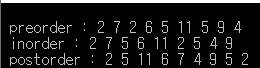
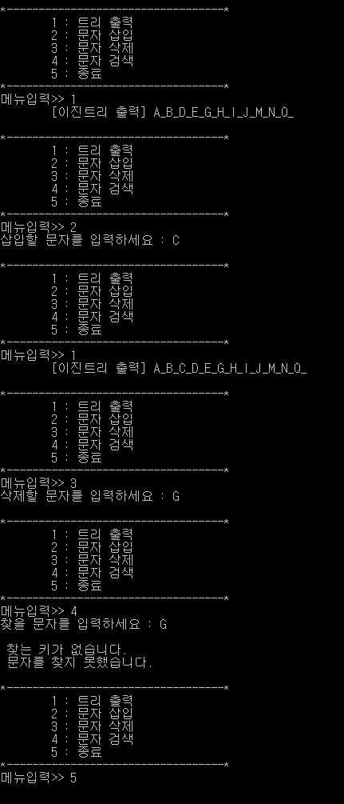

# 트리(Tree)

- 트리를 구성하는 원소를 **노드(Node)**라 하고, 노드를 연결하는 선을 간선(Edge)이라 한다.

- 트리의 시작노드를 **루트 노드(Root Node)**라고 하며 레벨은 0이다.

- 같은 부모 노드의 자식 노드들은 서로 **형제 노드(Sibling Node)**가 된다.

- 자식 노드들은 각각 독립하여 새로운 트리를 구성할 수 있으므로 각 노드는 자식 노드 수만큼의 **서브트리(Subtree)**를 갖는다.

- 한 노드가 가지는 서브 트리의 수, 즉 자식 노드의 수를 그 노드의 **차수(Degree)**라고 한다.

- 나무가 모이면 숲이 되듯이, 여러 트리들의 집합을 **포레스트(Forest)**라고 한다.

- `이진 트리` :  모든 노드의 차수를 2 이하로 제한하여 전체 트리의 차수가 2 이하가 되도록 정의한 것이 이진 트리(Binary Tree)이다. 

- 이진트리의 특징 : 

  1.  n개의 노드를 가진 이진 트리는 항상 (n-1)개의 간선을 가진다.

  2.  높이가 h인 이진 트리가 가질 수 있는 노드의 최소 개수는 (h+1)개가 되며, 
     $$
     최대 개수는 다음과 같다.(2^{h+1}+1)
     $$
     

- `포화 이진트리` : 모든 레벨에 노드가 꽉차서 높이를 늘이지 않는 한 더 이상 노드를 추가할 수 없는 포화 상태의 이진트리이다.

- `완전 이진트리` : 높이가 h고, 노드 수가 n개일 때, 노드의 위치가 포화 이진 트리에서의 노드 1번부터 n번까지의 위치와 완전히 일치하는 이진 트리이다. 

- `편향 이진트리` : 이진 트리 중에서 최소 개수의 노드를 가지면서 왼쪽이나 오른쪽 서브 트리만 가지고 있는 트리를 편향 이진 트리(Skwewed Binary Tree)라고 한다.

- 이진 트리 그림

  

  

  ### 이진 트리의 구현과  순회

  ```c
  #include <stdio.h>
  #include <stdlib.h>
  #include <memory.h>
  
  typedef struct treeNode { //트리 노드 정의
  	int data;
  	struct treeNode* left;
  	struct treeNode* right;
  }treeNode;
  
  treeNode* makeRootNode(int data, treeNode* leftNode, treeNode* rightNode) 
  { //data를 루트 노드로 하여 왼쪽 서브트리와 오른쪽 서브트리를 연결하는 연산
  	treeNode* root = (treeNode*)malloc(sizeof(treeNode));
  	root->data = data;
  	root->left = leftNode;
  	root->right = rightNode;
  	return root;
  }
  
  void preorder(treeNode* root) //이진 트리에 대한 전위 순회 연산
  {
  	if (root) {
  		printf("%d ", root->data);
  		preorder(root->left);
  		preorder(root->right);
  	}
  }
  
  void inorder(treeNode* root) //이진 트리에 대한 중위 순회 연산
  {
  	if (root) {
  		inorder(root->left);
  		printf("%d ", root->data);
  		inorder(root->right);
  	}
  }
  
  void postorder(treeNode* root) //이진 트리에 대한 후위 순회 연산
  {
  	if (root) {
  		postorder(root->left);
  		postorder(root->right);
  		printf("%d ", root->data);
  	}
  }
  
  int main()
  {
  	treeNode* n9 = makeRootNode(4, NULL, NULL);
  	treeNode* n8 = makeRootNode(11, NULL, NULL);
  	treeNode* n7 = makeRootNode(5, NULL, NULL);
  	treeNode* n6 = makeRootNode(9, n9, NULL);
  	treeNode* n5 = makeRootNode(6, n7, n8);
  	treeNode* n4 = makeRootNode(2, NULL, NULL);
  	treeNode* n3 = makeRootNode(5, NULL, n6);
  	treeNode* n2 = makeRootNode(7, n4, n5);
  	treeNode* n1 = makeRootNode(2, n2, n3);
  	
  	printf("\n preorder : ");
  	preorder(n1);
  
  	printf("\n inorder : ");
  	inorder(n1);
  
  	printf("\n postorder : ");
  	postorder(n1);
  
  	getchar();
  
  	return 0;
  }
  ```

  

### 실행 결과




### 이진 탐색 트리

```c
#include <stdio.h>
#include <stdlib.h>

typedef struct treeNode {
	char key;
	struct treeNode* left;
	struct treeNode* right;
}treeNode;

typedef char element;

treeNode* insertNode(treeNode* p, char x)
{ //포인터 p가 가리키는 노드와 비교하여 노드 x를 삽입하는 연산
	treeNode* newNode;
	if (p == NULL) {
		newNode = (treeNode*)malloc(sizeof(treeNode));
		newNode->key = x;
		newNode->left = NULL;
		newNode->right = NULL;
		return newNode;
	}
	else if (x < p->key) p->left = insertNode(p->left, x);
	else if (x > p->key) p->right = insertNode(p->right, x);
	else printf("\n 이미 같은 키가 있습니다! \n");

	return p;
}

void deleteNode(treeNode* root, element key)
{ // root 노드 부터 탐색하여 key값과 같은 노드를 찾아 삭제하는 연산
	treeNode* parent, * p, * succ, * succ_parent;
	treeNode* child;

	parent = NULL;
	p = root;
	while ((p != NULL) && (p->key != key)) {
		parent = p;
		if (key < p->key) p = p->left;
		else p = p->right;
	}
	if (p == NULL) {
		printf("\n 찾는 키가 이진 트리에 없습니다.");
		return;
	}

	//삭제할 노드가 단말 노드인 경우
	if ((p->left == NULL) && (p->right == NULL)) {
		if (parent != NULL) {
			if (parent->left == p) parent->left = NULL;
			else parent->right = NULL;
		}
		else root = NULL;
	}

	//삭제할 노드가 한개의 자식노드를 가진경우
	else if ((p->left == NULL) || (p->right == NULL)) {
		if (p->left != NULL) child = p->left;
		else child = p->right;

		if (parent != NULL) {
			if (parent->left == p) parent->left = child;
			else parent->right = child;
		}
		else root = child;
	}

	//삭제할 노드가 두개의 자식노드를 가진 경우
	else {
		succ_parent = p;
		succ = p->left;
		while (succ->right != NULL) {
			succ_parent = succ;
			succ = succ->right;
		}
		if (succ_parent->left == succ) succ_parent->left = succ->left;
		else succ_parent->right = succ->left;
		p->key = succ->key;
		p = succ;
	}
	free(p);
}

treeNode* searchBST(treeNode* root, char x)
{ //이진 탐색 트리에서 키값이 x인 노드의 위치를 탐색하는 연산
	treeNode* p;
	p = root;
	while (p != NULL) {
		if (x < p->key) p = p->left;
		else if (x == p->key) return p;
		else p = p->right;
	}
	printf("\n 찾는 키가 없습니다.");
	return p;
}

void displayInorder(treeNode* root)
{ // 이진 탐색 트리를 중위 순회하면서 출력하는 연산
	if (root) {
		displayInorder(root->left);
		printf("%c_", root->key);
		displayInorder(root->right);
	}
}

void menu()
{
	printf("\n*----------------------------------*");
	printf("\n\t1 : 트리 출력");
	printf("\n\t2 : 문자 삽입");
	printf("\n\t3 : 문자 삭제");
	printf("\n\t4 : 문자 검색");
	printf("\n\t5 : 종료");
	printf("\n*----------------------------------*");
	printf("\n메뉴입력>> ");
}

int main()
{
	treeNode* root = NULL;
	treeNode* foundedNode = NULL;
	char choice, key;

	root=insertNode(root, 'G'); //트리 만들기
	insertNode(root, 'I');
	insertNode(root, 'H');
	insertNode(root, 'D');
	insertNode(root, 'B');
	insertNode(root, 'M');
	insertNode(root, 'N');
	insertNode(root, 'A');
	insertNode(root, 'J');
	insertNode(root, 'E');
	insertNode(root, 'Q');

	while (1) {
		menu();
		scanf("%c", &choice);
		getchar();
		
		switch (choice) {
		case '1': printf("\t[이진트리 출력] ");
			displayInorder(root); printf("\n");
			break;
		
		case '2': printf("삽입할 문자를 입력하세요 : ");
			key = getchar(); getchar();
			insertNode(root, key);
			break;

		case '3': printf("삭제할 문자를 입력하세요 : ");
			key = getchar(); getchar();
			deleteNode(root, key);
			break;

		case '4': printf("찾을 문자를 입력하세요 : ");
			key = getchar(); getchar();
			foundedNode = searchBST(root, key);
			if (foundedNode != NULL)
				printf("\n %c를 찾았습니다! \n", foundedNode->key);
			else printf("\n 문자를 찾지 못했습니다. \n");
			break;

		case '5': return 0;
		}
	}
}
```


###  실행 결과



