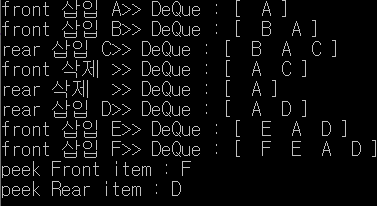

# 덱(Deque)

### 개념정리

- 덱은 큐의 양쪽 끝에서 삽입연산과 삭제연산을 수행할 수 있는 확장된 큐로서, 스택의 특성과 큐의 특성을 모두 가지고 있는 자료구조이다. 
- 덱의 insertFront() 연산과 deleteFront()연산은  front를 스택의 top으로 생각했을 때 스택의 push(), pop()연산과 같다.
- 덱의 insertRear()연산과 deleteRear()연산은 rear를 스택의 top으로 생각했을 때 스택의 push(), pop()연산과 같다. 그리고 덱의 insertRear()연산과 deleteFront()연산은 일반 큐의 enQueue(), deQueue()연산과 같다.

### 소스코드

```c
#include <stdio.h>
#include <malloc.h>

typedef char element;

typedef struct DQNode {
	element data;
	DQNode* llink;
	DQNode* rlink;
}DQNode;

typedef struct {
	DQNode* front, * rear;
}DQueType;

DQueType* createDQue() //공백덱을 생성하는 연산
{
	DQueType* DQ;
	DQ = (DQueType*)malloc(sizeof(DQueType));
	DQ->front = NULL;
	DQ->rear = NULL;
	return DQ;
}

int isEmpty(DQueType* DQ) //덱이 공백인지 확인하는 연산
{
	if (DQ->front == NULL) {
		printf("\n Linked Queue is empty! \n");
		return 1;
	}
	else return 0;
}

void insertFront(DQueType* DQ, element item)  //덱의 front 앞으로 삽입하는 연산
{
	DQNode* newNode = (DQNode*)malloc(sizeof(DQNode));
	newNode->data = item;
	if (DQ->front == NULL){ //덱이 공백인경우
		DQ->front = newNode;
		DQ->rear = newNode;
		newNode->rlink = NULL;
		newNode->llink = NULL;
	}
	else {
		DQ->front->llink = newNode;
		newNode->rlink = DQ->front;
		newNode->llink = NULL;
		DQ->front = newNode;
	}
}

void insertRear(DQueType* DQ, element item) // 덱의 rear뒤로 삽입하는 연산
{
	DQNode* newNode = (DQNode*)malloc(sizeof(DQNode));
	newNode->data = item;
	if (DQ->rear == NULL) { //덱이 공백인경우
		DQ->front = newNode;
		DQ->rear = newNode;
		newNode->rlink = NULL;
		newNode->llink = NULL;
	}
	else {
		DQ->rear->rlink = newNode;
		newNode->rlink = NULL;
		newNode->llink = DQ->rear;
		DQ->rear = newNode;
	}
}

element deleteFront(DQueType* DQ) // 덱의 front 노드를 삭제하고 반환하는 연산
{
	DQNode* old = DQ->front;
	element item;
	if (isEmpty(DQ)) return 0;
	else {
		item = old->data;
		if (DQ->front->rlink == NULL) {
			DQ->front = NULL;
			DQ->rear = NULL;
		}
		else {
			DQ->front = DQ->front->rlink;
			DQ->front->llink = NULL;
		}
		free(old);
		return item;
	}
}

element deleteRear(DQueType* DQ) // 덱의 rear노드를 삭제하고 반환하는 연산
{
	DQNode* old = DQ->rear;
	element item;
	if (isEmpty(DQ)) return 0;
	else {
		item = old->data;
		if (DQ->rear->llink == NULL) {
			DQ->front = NULL;
			DQ->rear = NULL;
		}
		else {
			DQ->rear = DQ->rear->llink;
			DQ->rear->rlink = NULL;
		}
		free(old);
		return item;
	}
}

int removeFront(DQueType* DQ) // 덱의 front 노드를 삭제하는 연산
{
	DQNode* old = DQ->front;
	if (isEmpty(DQ)) return 0;
	else if (DQ->front->rlink == NULL) {
		DQ->front = NULL;
		DQ->rear = NULL;
	}
	else {
		DQ->front = DQ->front->rlink;
		DQ->front->llink = NULL;
	}
	free(old); return 1;
}

int removeRear(DQueType* DQ) //덱의 rear노드를 삭제하는 연산
{
	DQNode* old = DQ->rear;
	if (isEmpty(DQ)) return 0;
	else if (DQ->rear->llink == NULL) {
		DQ->front = NULL;
		DQ->rear = NULL;
	}
	else {
		DQ->rear = DQ->rear->llink;
		DQ->rear->rlink = NULL;
	}
	free(old); return 1;
}

element peekFront(DQueType* DQ) //덱의 front 노드의 데이터 필드를 반환하는 연산
{
	element item;
	if (isEmpty(DQ)) return 0;
	else {
		item = DQ->front->data;
		return item;
	}
}

element peekRear(DQueType* DQ) //덱의 rear 노드의 데이터 필드를 반환하는 연산
{
	element item;
	if (isEmpty(DQ)) return 0;
	else {
		item = DQ->rear->data;
		return item;
	}
}

void printDQ(DQueType* DQ) //덱의 front 노드부터 rear노드까지 출력하는 연산
{
	DQNode* temp = DQ->front;
	printf("DeQue : [");
	while (temp) {
		printf("%3c", temp->data);
		temp = temp->rlink;
	}
	printf(" ] \n");
}

int main()
{
	DQueType* DQ1 = createDQue();
	element data;
	printf("front 삽입 A>> "); insertFront(DQ1, 'A'); printDQ(DQ1);
	printf("front 삽입 B>> "); insertFront(DQ1, 'B'); printDQ(DQ1);
	printf("rear 삽입 C>> "); insertRear(DQ1, 'C'); printDQ(DQ1);
	printf("front 삭제 >> "); deleteFront(DQ1); printDQ(DQ1);
	printf("rear 삭제  >> "); deleteRear(DQ1); printDQ(DQ1);
	printf("rear 삽입 D>> "); insertRear(DQ1, 'D'); printDQ(DQ1);
	printf("front 삽입 E>> "); insertFront(DQ1, 'E'); printDQ(DQ1);
	printf("front 삽입 F>> "); insertFront(DQ1, 'F'); printDQ(DQ1);

	data = peekFront(DQ1);  printf("peek Front item : %c \n", data);
	data = peekRear(DQ1); printf("peek Rear item : %c \n", data);

	return 0;
}
```

### 실행 결과



