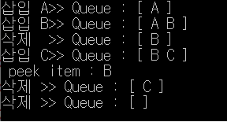
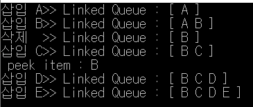

# 큐

### 개념정리

- 큐는 삽입된 순서대로 먼저 삽입된 자료가 먼저 삭제되는 **선입선출(FIFO)**의 구조로 운영된다.
- `front` : 큐의 한쪽끝을 front로 정하여 삭제연산만 수행하도록 하게 한다.
- `rear` : 큐의 다른쪽끝을 rear로 정하여 삽입 연산만 수행하도록 하게 한다.
- `enQueue` : 큐의 rear에서 이루어지는 삽입 연산을 enQueue라고 한다.
- `deQueue` : 큐의 front에서 이루어지는 삭제연산을 deQueue라고 한다.


### 스택과의 비교

|      | 삽입 연산 | 삽입 연산 | 삭제 연산 | 삭제 연산 |
| :--: | :-------: | :-------: | :-------: | :-------: |
|      |  연산자   | 삽입 위치 |  연산자   | 삭제 위치 |
| 스택 |   push    |    top    |    pop    |    top    |
|  큐  |  enQueue  |   rear    |  deQueue  |   front   |

### 소스코드(배열)

```c
#include <stdio.h>
#include <stdlib.h>

#define Q_SIZE 100

typedef struct
{
	char queue[Q_SIZE];
	int front, rear;
}QueueType;

QueueType* createQueue() //공백 큐를 생성하는 연산
{
	QueueType* Q;
	Q = (QueueType*)malloc(sizeof(QueueType));
	Q->front = -1;
	Q->rear = -1;
	return Q;
}

int isEmpty(QueueType* Q) // 큐가 공백인지 확인하는 연산
{
	if (Q->front == Q->rear) {
		printf("\n Queue is empty! \n");
		return 1;
	}
	else return 0;
}

int isFull(QueueType* Q) //큐가 포화상태인지 확인하는 연산
{
	if (Q->rear == Q_SIZE - 1) {
		printf("\n Queue is full! \n");
		return 1;
	}
	else return 0;
}

void enQueue(QueueType* Q, char item) //큐의 rear에 원소를 삽입하는 연산
{
	if (isFull(Q)) exit(1);
	else {
		Q->rear++;
		Q->queue[Q->rear] = item;
	}
}

char deQueue(QueueType* Q) //큐의 front에서 원소를 삭제하고 반환하는 연산
{
	if (isEmpty(Q)) exit(1);
	else
	{
		Q->front++;
		return Q->queue[Q->front];
	}
}

void del(QueueType* Q) //큐의 front에서 원소를 삭제하는연산
{
	if (isEmpty(Q)) exit(1);
	else Q->front++;
}

char peek(QueueType* Q) // 큐의 가장 앞에 있는 원소를 검색하여 반환하는 연산
{
	if (isEmpty(Q)) exit(1);
	else return Q->queue[Q->front + 1];
}

void printQ(QueueType* Q) //큐의 내용을 출력하는 연산
{
	int i;
	printf(" Queue : [");
	for (i = Q->front + 1; i <= Q->rear; i++)
		printf("%2c", Q->queue[i]);
	printf(" ] \n");
}

int main()
{
	QueueType* Q1 = createQueue();
	char data;
	printf("삽입 A>>"); enQueue(Q1, 'A'); printQ(Q1);
	printf("삽입 B>>"); enQueue(Q1, 'B'); printQ(Q1);
	printf("삭제  >>"); deQueue(Q1); printQ(Q1);
	printf("삽입 C>>"); enQueue(Q1, 'C'); printQ(Q1);
	data = peek(Q1); printf(" peek item : %c \n", data);
	printf("삭제 >>"); deQueue(Q1); printQ(Q1);
	printf("삭제 >>"); deQueue(Q1); printQ(Q1);

	getchar();
	return 0;
}
```

### 실행 결과



### 소스코드(연결리스트)

```c
#include <stdio.h>
#include <malloc.h>

typedef char element;

typedef struct QNode {
	element data;
	struct QNode* link;
}QNode;

typedef struct { //연결 큐에서 사용하는 포인터 front와 rear를 구조체로 정의
	QNode* front, * rear;
}LQueueType;

LQueueType* createLinkedQueue() //공백 연결 큐 생성 연산
{
	LQueueType* LQ;
	LQ = (LQueueType*)malloc(sizeof(LQueueType));
	LQ->front = NULL;
	LQ->rear = NULL;
	return LQ;
}

int isEmpty(LQueueType* LQ) //연결 큐가 공백인지 확인하는 연산
{
	if (LQ->front == NULL)
	{
		printf("\n Linked Queue is empty! \n");
		return 1;
	}
	else return 0;
}

void enQueue(LQueueType* LQ, element item) //연결 큐의 rear에 원소를 삽입하는 연산
{
	QNode* newNode = (QNode*)malloc(sizeof(QNode));
	newNode->data = item;
	newNode->link = NULL;
	if (LQ->front == NULL) { //현재 연결큐가 공백인 경우
		LQ->front = newNode;
		LQ->rear = newNode;
	}
	else { //현재 연결큐가 공백이 아닌 경우
		LQ->rear->link = newNode;
		LQ->rear = newNode;
	}
}

element deQueue(LQueueType* LQ) //연결 큐에서 front원소를 삭제하고 반환하는 연산
{
	QNode* old = LQ->front;
	element item;
	if (isEmpty(LQ)) return 0;
	else {
		item = old->data;
		LQ->front = LQ->front->link;
		if (LQ->front == NULL)
			LQ->rear = NULL;
		free(old);
		return item;
	}
}

int del(LQueueType* LQ) //연결 큐에서 front 원소를 삭제하는 연산
{
	QNode* old = LQ->front;
	if (isEmpty(LQ)) return 0;
	else {
		LQ->front = LQ->front->link;
		if (LQ->front == NULL)
			LQ->rear = NULL;
		free(old);
		return 1;
	}
}

element peek(LQueueType* LQ) //연결 큐에서 front 원소를 검색하여 반환하는 연산
{
	element item;
	if (isEmpty(LQ)) return 0;
	else {
		item = LQ->front->data;
		return item;
	}
}

void printLQ(LQueueType* LQ)
{
	QNode* temp = LQ->front;
	printf(" Linked Queue : [");
	while (temp) {
		printf("%2c", temp->data);
		temp = temp->link;
	}
	printf(" ] \n");
}

int main()
{
	LQueueType* LQ1 = createLinkedQueue();
	element data;
	printf("삽입 A>>"); enQueue(LQ1, 'A'); printLQ(LQ1);
	printf("삽입 B>>"); enQueue(LQ1, 'B'); printLQ(LQ1);
	printf("삭제  >>"); deQueue(LQ1); printLQ(LQ1);
	printf("삽입 C>>"); enQueue(LQ1, 'C'); printLQ(LQ1);
	data = peek(LQ1); printf(" peek item : %c \n", data);
	printf("삽입 D>>"); enQueue(LQ1, 'D'); printLQ(LQ1);
	printf("삽입 E>>"); enQueue(LQ1, 'E'); printLQ(LQ1);

	return 0;
}
```

### 실행 결과



