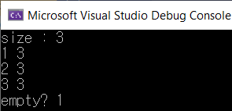
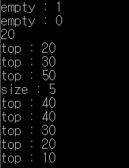

# STL Library - Queue, Priority_Queue

큐는 **FIFO(First In First Out)** 방식으로 동작되며 한쪽 끝에서 삽입되어 다른쪽 끝으로 나가는 구조를 가지고 있다.  

큐 컨테이너는 deque와 list 컨테이너에 붙어서 사용가능하나 **vector 컨테이너에는 불가능**하다.

### 큐 선언 방법

```C++
#include <iostream> 
#include <queue>  //큐 라이브러리 
using namespace std;
int main() 
{
	queue <int> q; //큐 선언
}
```


### 큐 제공 함수

- `push` :   큐에 오브젝트 추가 ex) q.push(1);

  

- `size` :  큐의 현재 사이즈 반환 ex) q.size();

  

- `front` :  큐의 맨 위 반환 ex)q.front();

  

- `back` : 큐의 맨 밑 반환 ex)q.back();


- `empty` : 큐가 비었는지 확인하고 비었으면 true반환 ex) q.empty();


- `pop` : 큐의 맨 위 삭제  ex) q.pop();


- `swap` : 서로다른 큐를 교환 ex) q.swap(q2);


### 큐 사용 예시 코드

```c++
#include <iostream> #include <queue>
using namespace std;
int main() 
{
	queue <int> q;  //큐 선언
    
    q.push(1); 
    q.push(2); 
    q.push(3);
    
	cout << "size : " << q.size() << "\n"; //큐의 사이즈 반환
	
	cout << q.front() <<" "<<q.back() << "\n";    // 큐의 맨 위와 맨 밑 반환 
	q.pop(); // 큐의 맨 위 삭제
	
	cout << q.front() << " " << q.back() << "\n";    // 큐의 맨 위와 맨 밑 반환 
	q.pop(); // 큐의 맨 위 삭제
	
	cout << q.front() << " " << q.back() << "\n";    // 큐의 맨 위와 맨 밑 반환 
	q.pop(); // 큐의 맨 위 삭제
    
	cout << "empty? " << q.empty() << endl;  // 큐가 비었는지 bool 값 반환 
    return 0;
}
```

### 실행 결과



## 우선순위 큐

### 개념

- 우선순위 큐는 <queue> 헤더파일 안에 있는 것으로 큐와는 달리 원소의 최댓값이나 최솟값을 내놓는다.
- priority_queue는 vector, deque container와 붙어서 사용이 가능하다.

### 우선순위 선언법

- 기본 생성자 형식 : priority_queue <int> pq;
- 내부 컨테이너 변경 : priority_queue<int, deque<int>> pq;
- 정렬 기준 변경 : priority_queue<int , vector<int>, greater<int> > pq;

### 우선순위 큐 제공함수

- `empty` : 우선순위 큐가 비어있는지 확인 ex) pq.empty()
- `size` : 우선순위 큐의 size를 반환 ex) pq.size()
- `top` : 우선순위큐의 위의 원소를 반환 ex) pq.top()
- `push` : 우선순위 큐에 원소 삽입 ex) pq.push(1)
- `pop` : 우선순위 큐의 맨 위 원소 삭제 반환은 x ex) pq.pop()

### 소스코드

```c++
#include <iostream>
#include <queue>

using namespace std;

int main()
{
	priority_queue <int> pq;

	cout << "empty : " << pq.empty() << endl;
	pq.push(20);
	cout << "empty : " << pq.empty() << endl;
	cout << pq.top() << endl;

	pq.push(10);
	cout <<"top : " << pq.top() << endl;

	pq.push(30);
	cout << "top : " << pq.top() << endl;

	pq.push(50);
	pq.push(40);
	cout << "top : " << pq.top() << endl;
	cout << "size : " << pq.size() << endl;

	pq.pop();
	cout << "top : " << pq.top() << endl;

	while (!pq.empty()) {
		cout << "top : " << pq.top() << endl;
		pq.pop();
	}
	return 0;
}
```


### 실행 결과



