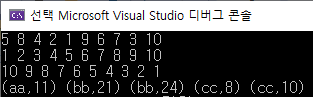

# STL Library - sort

sort 알고리즘은 <algorithm> 헤더에 속해있다.

퀵정렬을 기반으로 함수가 구현 되어있으며 평균 시간복잡도는 nlogn이다.

### 사용법

template <typename T>

void sort(T start, T end);

void sort(T start, T end, Compare comp);

**예시**

- sort(arr, arr+n);
- sort(v.begin(), v.end());
- sort(v.begin(),v.end(), compare);  //compare는 사용자 정의 함수이다.
- sort(v.begin(),v.end(),greater<자료형>()); //내림차순
- sort(v.begin(),v.end(),less<자료형>()); //오름차순


### 사용 예시 코드

```c++
#include <iostream>
#include <algorithm>
#include <vector>

using namespace std;

class Student
{
public:
	string name;
	int age;
	Student(string name, int age) :name(name), age(age) {}
};

bool compare(Student a, Student b)
{
	if (a.name == b.name) //이름 같으면 나이가 적은순으로 정렬
	{
		return a.age < b.age;
	}
	else
	{
		return a.name < b.name; //이름이 다르면 사전순으로 정렬
	}
}
int main()
{
	int arr[10] = { 5, 8, 4, 2, 1, 9, 6, 7, 3, 10 };

	for (int i = 0; i < 10; i++)
		cout << arr[i] << " ";

	sort(arr, arr + 10);  //default 오름차순 정렬

	cout << endl;
	for (int i = 0; i < 10; i++)
		cout << arr[i] << " ";

	
	sort(arr, arr + 10, greater<int>()); //내림차순 정렬
	cout << endl;
	for (int i = 0; i < 10; i++)
		cout << arr[i] << " ";

	//compare 함수를 만들어서 정렬
	vector <Student> v;
	v.push_back(Student("cc", 10));
	v.push_back(Student("bb", 24));
	v.push_back(Student("aa", 11));
	v.push_back(Student("cc", 8));
	v.push_back(Student("bb", 21));

	sort(v.begin(), v.end(), compare); //compare함수이용 정렬
	cout << endl;
	for (int i = 0; i < 5; i++)
	{
		cout << "(" << v[i].name << "," << v[i].age << ") ";
	}
	return 0;
}

```


### 출력 결과

