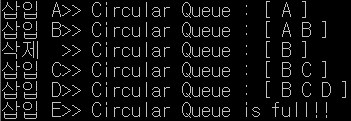

# 원형 큐

### 개념정리

- 일반 큐와 달리 front와 rear의 **초기상태를 0**으로 지정한다.
- 일반 큐와 달리 empty의 구분을 쉽게하기 위해서 큐의 한공간을 비워둔채 full한다.
- 원형 큐에서는 배열의 인덱스가 n-1다음에 다시 0이 되어야 하므로 사용할 인덱스를 조정하기 위해서 나머지 연산자인 mod를 사용한다.
- 원형 큐에서 **공백상태**가 되는 경우는 초기의 front=rear=0 인경우와 마지막 남은 원소를 삭제한 자리에 front와 rear가 동시에 위치한 상태이다. 따라서 **front=rear**가 공백의 조건이된다.
- 원형 큐에서 **포화상태**는 front가 있는 자리 하나를 항상 비워두기로 했으므로 **(rear+1) % Queue_size = front** 가 된다.

### 소스코드

```c
#include <stdio.h>
#include <stdlib.h>
#define cQ_SIZE 4

typedef char element;

typedef struct {
	element queue[cQ_SIZE];
	int front, rear;
}cQueueType;

cQueueType* createQueue()
{
	cQueueType* cQ;
	cQ = (cQueueType*)malloc(sizeof(cQueueType));
	cQ->front = 0; // 원형 큐의 front 초기값 설정
	cQ->rear = 0; // 원형 큐의 rear 초기값 설정
	return cQ;
}

int isEmpty(cQueueType* cQ) //원형큐가 비어있는지 확인
{
	if (cQ->front == cQ->rear)
	{
		printf(" Circular Queue is Empty! \n");
		return 1;
	}
	else return 0;
}

int isFull(cQueueType* cQ) //원형 큐가 가득차있는지 확인
{
	if (((cQ->rear + 1) % cQ_SIZE) == cQ->front) { //비어있는지 확인하는 것과 구분해주기위해 한칸을 비워둔다
		printf(" Circular Queue is full!! \n");
		return 1;
	}
	else return 0;
}

void enQueue(cQueueType* cQ, element item) //원형큐에 원소를 등록
{
	if (isFull(cQ)) exit(1);
	else {
		cQ->rear = (cQ->rear + 1) % cQ_SIZE;
		cQ->queue[cQ->rear] = item;
	}
}

element deQueue(cQueueType* cQ) //원형큐에front에서 있는 원소 삭제하고 반환
{
	if (isEmpty(cQ)) exit(1);
	else {
		cQ->front = (cQ->front + 1) % cQ_SIZE;
		return cQ->queue[cQ->front];
	}
}

void del(cQueueType* cQ) { //원형큐에 있는 원소 삭제
	if (isEmpty(cQ)) exit(1);
	else cQ->front = (cQ->front + 1) % cQ_SIZE;
}

element peek(cQueueType* cQ) //원형큐에 있는 가장 앞에있는 원소를 검색하여 반환
{
	if (isEmpty(cQ)) exit(1);
	else return cQ->queue[(cQ->front + 1) % cQ_SIZE];
}

void printQ(cQueueType* cQ) //원형 큐 프린트
{
	int i, first, last;
	first = (cQ->front + 1) % cQ_SIZE;
	last = (cQ->rear + 1) % cQ_SIZE;
	printf(" Circular Queue : [");
	i = first;
	while (i != last) {
		printf("%2c", cQ->queue[i]);
		i = (i + 1) % cQ_SIZE;
	}
	printf(" ] \n");
}

int main()
{
	cQueueType* cQ1 = createQueue();
	element data;
	printf("삽입 A>>"); enQueue(cQ1, 'A'); printQ(cQ1);
	printf("삽입 B>>"); enQueue(cQ1, 'B'); printQ(cQ1);
	printf("삭제  >>"); deQueue(cQ1);      printQ(cQ1);
	printf("삽입 C>>"); enQueue(cQ1, 'C'); printQ(cQ1);
	printf("삽입 D>>"); enQueue(cQ1, 'D'); printQ(cQ1);
	printf("삽입 E>>"); enQueue(cQ1, 'E'); printQ(cQ1);

	getchar();
	return 0;
}
```

### 실행 결과



