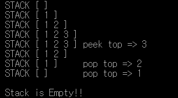
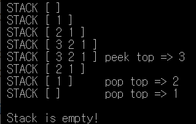

# 스택

### 개념

- 스택은 시간순서에 따라 자료가 쌓여서 가장 마지막에 삽입된 자료가 가장 먼저 삭제 된다는 구조적 특징을 갖는다. 이러한 스택의 구조를 **후입선출(LIFO)** 이라고 한다.
- `push` : 스택의 top을 통한 삽입 연산을 말한다.
- `pop` : 스택을 통한 삭제 연산을 말한다. 
- `peek` : 현재 스택의 맨 꼭대기의 원소를 반환하는 것을 말한다.
- `del` : 스택의 꼭대기(top)을 삭제하는 함수
- `print` : 스택의 모든 원소를 출력한다.


### 배열을 활용한 소스코드

```c
#include <stdio.h>
#include <stdlib.h>
#define STACK_SIZE 100

int stack[STACK_SIZE];
int top = -1;

void push(int item) // 원소를 추가하는 함수
{
	if (top >= STACK_SIZE - 1) {
		printf("\n\n Stack is Full ! \n");
		return;
	}
	else stack[++top] = item;
}

int pop() //맨 위 원소를 삭제후 반환하는 함수
{
	if (top == -1)
	{
		printf("\n\n Stack is Empty!!\n");
		return 0;
	}
	else return stack[top--];
}

void del() //맨 위의 원소를 삭제하는 원소
{
	if (top == -1)
	{
		printf("\n\n Stack is Empty !\n");
		exit(1);
	}
	else top--;
}

int peek() //현재 원소를 가져오는 함수
{
	if (top == -1) {
		printf("\n\n Stack is Empty !\n");
		exit(1);
	}
	else return stack[top];
}

void printStack() // 현재 원소를 모두 print 하는 함수
{
	int i;
	printf("\n STACK [ ");
	for (i = 0; i <= top; i++)
		printf("%d ", stack[i]);
	printf("] ");
}

int main()
{
	int item;
	printStack();
	push(1);
	printStack();
	push(2);
	printStack();
	push(3);
	printStack();

	item = peek();
	printStack();
	printf("peek top => %d", item);

	del();
	printStack();
	item = pop();
	printStack();
	printf("\t pop top => %d", item);

	item = pop();
	printStack();
	printf("\t pop top => %d", item);

	pop();

	getchar();

	return 0;
}
```

### 출력 결과

  

### 리스트를 활용한 소스코드

```c
#include <stdio.h>
#include <stdlib.h>
#include <string.h>

typedef struct stackNode {
	int data;
	stackNode* link;
}stackNode;

stackNode* top;

void push(int item)
{
	stackNode* temp = (stackNode*)malloc(sizeof(stackNode));
	temp->data = item;
	temp->link = top;
	top = temp;
}

int pop()
{
	int item;
	stackNode* temp = top;

	if (top == NULL)
	{
		printf("\n\n Stack is empty! \n");
		return 0;
	}
	else
	{
		item = temp->data;
		top = temp->link;
		free(temp);
		return item;
	}
}

int peek()
{
	int item;
	if (top == NULL)
	{
		printf("\n\n Stack is empty !\n");
		return 0;
	}
	else
	{
		item = top->data;
		return item;
	}
}

void del()
{
	stackNode* temp;
	if (top == NULL)
	{
		printf("\n\n Stack is empty !\n");
	}
	else
	{
		temp = top;
		top = top->link;
		free(temp);
	}
}

void printStack()
{
	stackNode* p = top;
	printf("\n STACK [ ");
	while (p) {
		printf("%d ", p->data);
		p = p->link;
	}
	printf("] ");
}

int main()
{
	int item;
	top = NULL;
	printStack();
	push(1);
	printStack();
	push(2);
	printStack();
	push(3);
	printStack();

	item = peek();
	printStack();
	printf("peek top => %d", item);

	del();
	printStack();

	item = pop();
	printStack();
	printf("\t pop top => %d", item);

	item = pop();
	printStack();
	printf("\t pop top => %d", item);

	pop();

	return 0;
}
```

### 실행 결과

