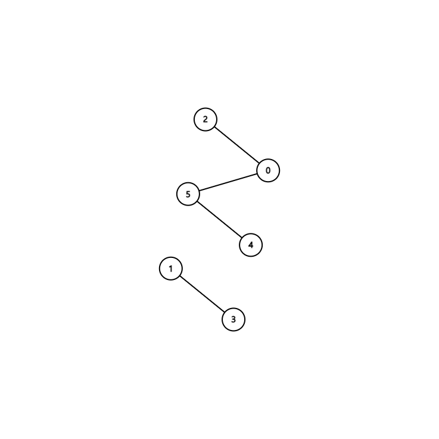

# 유니온 파인드 알고리즘

### 1.유니온 파인드란?

집합을 관리하는 트리 형태의 자료구조로, 주로 그래프 문제에 적용할 때 사용하며, 순수히 `노드간의 연결관계`를 파악할 때 유용합니다.



예를 들어 위와같은 그래프가 있을 때 유니온 파인드 알고리즘을 이용하면 노드3과 노드4가 연결 관계인지 아닌지를 파악할 수 있습니다.

그럼 코드를 보면서 설명을 이어나가겠습니다.

### 2. 코드

```python
def find(target):
    if target == parent[target]:
        return target
	
    #경로 압축 최적화
    parent[target] = find(parent[target])
    return parent[target]


def union(a, b):
    a = find(a)
    b = find(b)
	
    # 작은 루트 노드를 기준으로 합침
    if a < b:
        parent[b] = a
    else:
        parent[a] = b


parent = [0, 1, 2, 3, 4, 5, 6]

if find(3) == find(5):
    print("같은 집합입니다.")
else:
    print("다른 집합입니다.")

union(3, 5)

if find(3) == find(5):
    print("같은 집합입니다.")
else:
    print("다른 집합입니다.")
```

### 3. 코드 설명

유니온 파인드 알고리즘의 핵심연산은 find와 union 두가지가 있습니다.

먼저 find 연산입니다.

- find 연산은 어떤 노드를 인자로 넘겼을 때, 해당 노드의 루트 노드를 반환하는 연산입니다.
- 이 연산은 임의의 두 노드가 연결되어 있는지 확인할 때 쓰이고 재귀호출의 형태로 구현됩니다.

- 또한, 시간복잡도 효율을 높이기 위해 find연산에서 경로 압축 최적화를 수행합니다. (재귀 호출시 자식 노드들의 값을 모두 루트 노드로 바꿉니다.)

다음으로 union 연산입니다.

- 유니온 연산은 두개의 노드를 합치는 연산으로 사전에 find 연산이 요구됩니다.
- 보통 각 트리의 루트노드를 비교하여 둘중 작은 루트 노드를 기준으로 합치게 됩니다.


### 4. 시간 복잡도

유니온 파인드는, 평균적으로 트리의 높이만큼 탐색하는 O(logN)을 갖지만, 트리를 형성하는 과정에서 편향트리(Skewed Tree)가 될 수 있스빈다. 이렇게 될 경우 시간복잡도는 O(n)이 되버립니다.

따라서, 효율성을 위해 Find과정에서 경로압축을 사용합니다. 

경로 압축을 하게 되면, find 함수를 호출할 때마다 트리의 높이가 매번 달라지게 되므로 수행시간이 변하게 됩니다.

경로 압축을 한 find의 시간 복잡도는 O(a(N))이 되는데 여기서 a(N)은 [아커만 함수](https://ko.wikipedia.org/wiki/%EC%95%84%EC%BB%A4%EB%A7%8C_%ED%95%A8%EC%88%98)를 의미합니다.

아커만 함수에서 N이 2^65536일 때, 아커만 함수의 값은 5가 되므로 **상수의 시간 복잡도**를 가진다고 봐도 무방합니다.